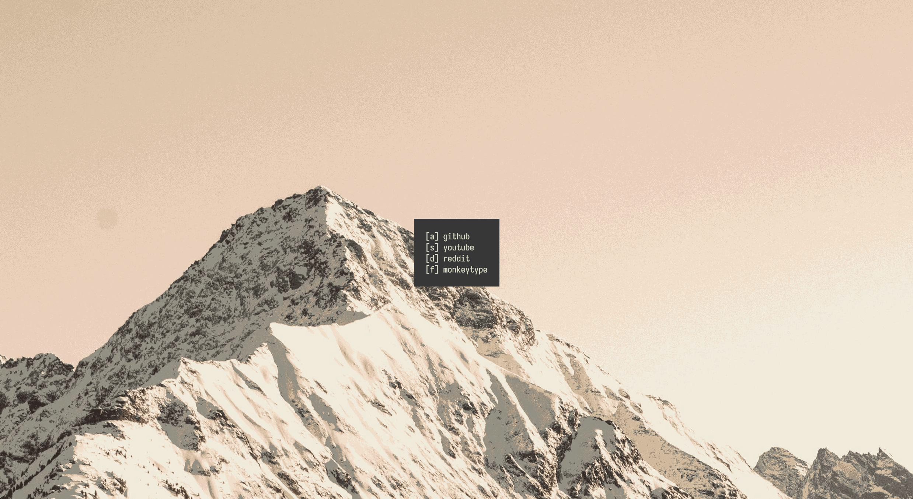

# Custom Browser Start Page

Just a simple start page to replace the default one.

Browser Integration:

In order for this to work, your browser must support having custom home pages. For the Brave browser, this is done through enabling "Show home button" and the providing the absolute path to the html file, prefixed with "file://"

Example: `file:///Users/username/dev/min-startup/index.html`
