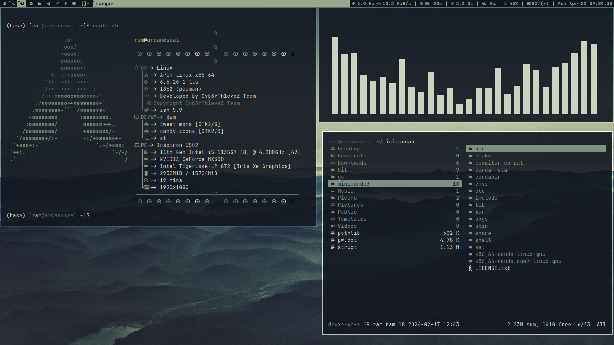
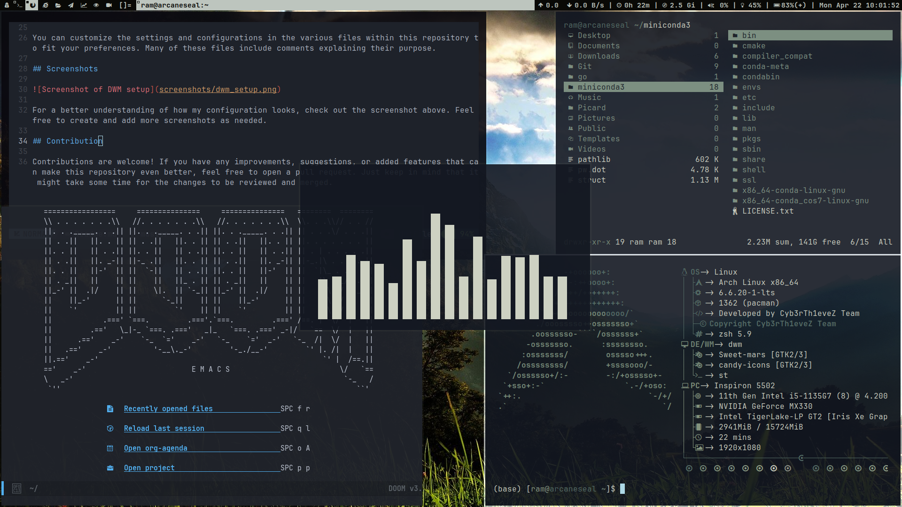
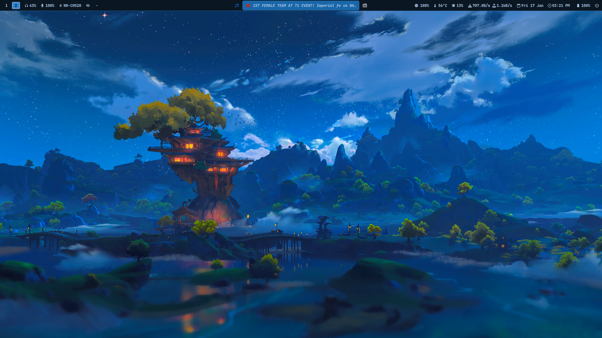
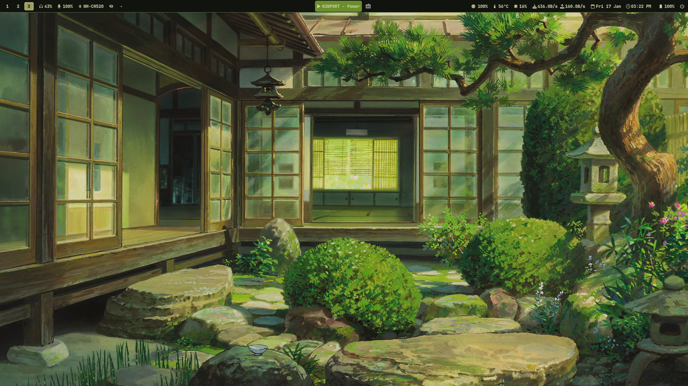

# Dotfiles Repository
      
This repository contains my personal configuration files for various applications and settings on Arch Linux with the DWM window manager. These files are essential for my system to look and function as I prefer. I recommend cloning this repository into your home directory (`~/`) for easy integration into your own setup.

`NOTE - Please don't create any Issues or Pull Requests. These dotfiles are only for my personal use.`

## Automated Installation 

Fist install Arch Linux with minimal setup/any other DE/WM with `archinstall` script and reboot your system. use `sudo nmtui-connect` command for wireless internet connection. Then clone this repo using 

```bash 
curl -sL https://tinyurl.com/karnadotfiles -o install.sh
```

```bash 
./install.sh
```

Read install.sh carefully and modify options whatever you want and just run or if you want to directly run it then

```bash 
bash <(curl -sL https://tinyurl.com/karnadotfiles)
```

Note:`Please dont stow any folder which ends with _karna, because those are my files which works only with my system and may break your system.`

## Manual Installation

1. I have used stow to manage the dotfiles, so you need to install stow:
```bash
sudo pacman -S stow
```

2. Clone this repository into your home directory:
```bash
git clone https://gitlab.com/Chaganti-Reddy/dotfiles.git ~/dotfiles
```

3. Change into the `dotfiles` directory:
```bash
cd ~/dotfiles
```

4. Use stow to symlink the configuration files you want to use. For example, to install the DWM configuration files:
```bash 
stow suckless
```
Don't forget to use the dwm.desktop file to show dem in sddm from Extras/Extras/usr/share/xsessions

5. Repeat the stow command for any other configuration files you want to use.

6. Now all the configuration files are symlinked to your home directory, and .config directory. You can now use these configurations in your system.

7. To install the dwm, dmenu, st and slstatus, go to .config directory and make install in those respective folders:
```bash
cd .config/{}
sudo make clean install
```

8. There are still a lot application configurations and scripts which may be useful for you like ani-cli, grub theme etc., just go through every folder and fell free to use them in your system

9. Make sure there is no .stow-local-ignore files in the config directory you want to use, else it will ignore the files in that directory.

10. If you have any doubt feel free to comment it and make sure you watch the youtube videos regarding that particular application before commenting in gitlab.

11. Also there is an install.sh script which contains my packages list to install, check it and uncomment or comment lines as per your need

12. If you are dual-booting with windows then there might be problems with time in windows. To resolve that open cmd as admin in windows
    - For 32 Bit System rum
          `Reg add HKLM\SYSTEM\CurrentControlSet\Control\TimeZoneInformation /v RealTimeIsUniversal /t REG_DWORD /d 1`
    - For 64 Bit System run
          `Reg add HKLM\SYSTEM\CurrentControlSet\Control\TimeZoneInformation /v RealTimeIsUniversal /t REG_QWORD /d 1`

13. If you are installing my nvim_gen config then first change the theme name in ~/.config/nvim/lua/chadrc.lua file to something like `nightowl` then after successfully loading all the plugins and if you have pywal setup then change the theme name back to `chadwal`.

14. If you want to use brave browser then go to `brave://flags/` and change `Preferred Ozone platform` option to `auto` to automatically select the session between both wayland and xorg.

15. If you are using Vivaldi browser then go to `vivaldi://flags/#ozone-platform-hint` and make it auto and also go to `chrome://settings` and turn on gtk for dark context menus. Also if you want custom fonts in titlebars which is not available by default then just go to `vivaldi:experiments` and turn on Allow CSS modifications & just stow the vivaldi folder from dotfiles. After just upload the path of Default/Themes folder to Appearance settings.

16. If you are using zen-browser, to import mods cp ~/dotfiles/Extras/Extras/zen-mods/zen-themes.json to ~/.zen/Default(Release) folder. And also if you want to get the new empty tab instead of blank page in Zen then goto `about:config` and set `zen.urlbar.replace-newtab` to false.

17. If you my DWM config then there are seperate repos in my [Github](https://github.com/Chaganti-Reddy/) account, just use them and you can find scripts here itself in `dotfiles/DWMScripts folder`. I'm a bit lazy to code the installation process in `install.sh`, so please enjoy from there.

## Configuration

You can customize the settings and configurations in the various files within this repository to fit your preferences. Many of these files include comments explaining their purpose.

## Screenshots






For a better understanding of how my configuration looks, check out the screenshot above. Feel free to create and add more screenshots as needed.

## Programs

The main program I use for my daily life:

- **Window Manager**: I3, HyprLand
- **Terminal**: St, Kitty
- **Shell**: Zsh
- **Editor**: Neovim, Emacs
- **File Manager**: Yazi, Thunar
- **Browser**: QuteBrowser, Zen Browser 
- **Music Player**: Mpd + Ncmpcpp
- **Video Player**: MPV
- **PDF Viewer**: Zathura
- **Image Viewer**: sxiv
- **Launcher**: Rofi
- **Notification Daemon**: Dunst
- **Screenshot Tool**: Flameshot
- **System Monitor**: Btop
- **Music Downloader**: Yt-dlp
- **Youtube Player**: Mpv + Ytfzf
- **Clipboard Manager**: xfce4-clipman, clipse
- **Screen Recorder**: OBS
- **IDE**: Neovim/Emacs
- **Torrent Client**: Webtorrent, Peerflix
- **Office Suite**: LibreOffice
- **Password Manager**: Pass
- **Backup Tool**: Timeshift
- **System Information**: Neofetch
- **Anime Downloader**: Ani-cli 
- **Grub Theme**: SekiroShadow Grub theme
- **Wallpapers**: Wallpapers from Wallhaven using waldl script 

For entire system I am using pywal for color scheme matching with wallpaper. And for zathura I am using Zathura-Pywal. And for webapps I am using firefoxpwa plugin. 

## License

This repository is licensed under the MIT License. For more information, see the `LICENSE` file.
