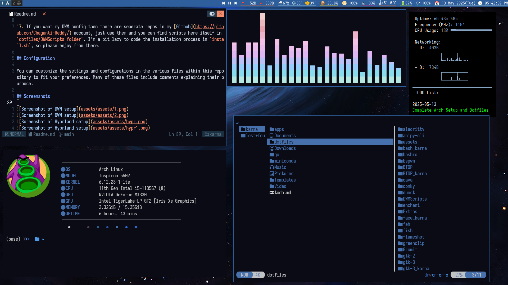

# Karna's Arch Linux Dotfiles

This repository contains my personal configuration files (dotfiles) for **Arch Linux**. It includes setups for **I3, BSPWM, Qtile, and Hyprland** window managers, as well as **KDE Plasma**.

These files are tailored to my specific workflow, utilizing `pywal` for system-wide color scheme integration.

> [!WARNING]
> **Personal Use Only:** Please do not create Issues or Pull Requests. These dotfiles are tuned for my hardware and username. Some configs may contain **absolute paths**. If something crashes, please check the file paths first.

## 📋 Table of Contents
- [Prerequisites](#-prerequisites)
- [Installation](#-installation)
    - [Automated](#automated-installation)
    - [Manual (Stow)](#manual-installation)
- [Post-Install & Specific Fixes](#-post-install--specific-fixes)
- [Software Stack](#-software-stack)
- [Screenshots](#-screenshots)
- [Extras (ChatGPT Prompt)](#-extras)
- [Credits & License](#-credits--license)

---

## 🛠 Prerequisites

Before installing, ensure you have a minimal Arch Linux installation. I personally recommend using `archinstall` to set up the base system with KDE and Hyprland.

**Network Setup:**
If you are on a fresh install, use `nmtui` to connect to the internet:
```bash
sudo nmtui-connect
```

**Required Tools:**
- `git`
- `stow`
- `make` (for suckless tools)

---

## 🚀 Installation

### Automated Installation

I have created an installation script to automate the process. Read the script carefully before running it.

**1. Standard Install:**
Clones the repo and runs the script.
```bash
curl -sL https://tinyurl.com/karnadotfiles -o install.sh
chmod +x install.sh
./install.sh
```

**2. One-Liner (Run directly):**
```bash
bash <(curl -sL https://tinyurl.com/karnadotfiles)
```

> **Note:** Included in the scripts is `install_kde_hyprland_arch.sh` for my specific KDE+Hyprland setup. Check the `install.sh` file to comment/uncomment packages as per your needs.

### Manual Installation

If you prefer to cherry-pick configurations, use GNU Stow.

**1. Install Stow:**
```bash
sudo pacman -S stow
```

**2. Clone Repository:**
```bash
git clone https://gitlab.com/Chaganti-Reddy/dotfiles.git ~/dotfiles
cd ~/dotfiles
```

**3. Symlink Configurations:**
Use stow to link specific folders. For example, to install `suckless` tools or `dunst`:
```bash
stow suckless
stow dunst
# Repeat for other folders you want to use
```

> [!CAUTION]
> **Do not stow** any folder ending in `_karna`. These contain files hardcoded strictly for my system and may break yours.
> Ensure there are no `.stow-local-ignore` files in the directories you are stowing.

**4. Install Suckless Tools (DWM, st, dmenu):**
After stowing the `suckless` folder, compile them:
```bash
cd ~/.config/{dwm,st,dmenu,slstatus} # Enter folder one by one
sudo make clean install
```
*Tip: Ensure you copy the `dwm.desktop` file from `Extras/Extras/usr/share/xsessions` to `/usr/share/xsessions/` to see it in your display manager (SDDM).*

---

## 🔧 Post-Install & Specific Fixes

Since I use a variety of specific tools, here are the fixes and tweaks for them.

<details>
<summary><b>🪟 Windows Dual-Boot Time Fix</b></summary>

If Windows displays the wrong time after booting Linux:

**Run CMD as Administrator in Windows:**

*For 32-bit Systems:*
```cmd
Reg add HKLM\SYSTEM\CurrentControlSet\Control\TimeZoneInformation /v RealTimeIsUniversal /t REG_DWORD /d 1
```
*For 64-bit Systems:*
```cmd
Reg add HKLM\SYSTEM\CurrentControlSet\Control\TimeZoneInformation /v RealTimeIsUniversal /t REG_QWORD /d 1
```
</details>

<details>
<summary><b>🦁 Brave & Vivaldi Browser Tweaks (If you use)</b></summary>

**Brave:**
1. Go to `brave://flags/`
2. Set `Preferred Ozone platform` to `Auto` (Selects Wayland/Xorg automatically).

**Vivaldi:**
1. Go to `vivaldi://flags/#ozone-platform-hint` -> Set to `Auto`.
2. Go to `chrome://settings` -> Turn on GTK for dark context menus.
3. **Custom CSS:** Go to `vivaldi:experiments` -> Enable "Allow CSS modifications".
4. Stow the `vivaldi` folder from this repo.
5. In Vivaldi Settings -> Appearance, upload the path to the `Default/Themes` folder.
</details>

<details>
<summary><b>🧘 Zen Browser Mods</b></summary>

1. **Import Mods:** Copy `~/dotfiles/Extras/Extras/zen-mods/zen-themes.json` to `~/.zen/Default(Release)/`.
2. **New Tab Fix:** To get an empty new tab instead of a blank page, go to `about:config` and set `zen.urlbar.replace-newtab` to `false`.
</details>

<details>
<summary><b>📝 Neovim (Chadrc & Pywal)</b></summary>

If using my `nvim_gen` config:
1. Open `~/.config/nvim/lua/chadrc.lua`.
2. Change the theme to something standard like `nightowl`.
3. Let plugins install.
4. Once `pywal` is set up, change the theme back to `chadwal`.
</details>

---

## 💻 Software Stack

My system is unified using **Pywal** for color generation (matches wallpaper) and **Nativefier** for web apps.

| Category | Application(s) |
| :--- | :--- |
| **Window Managers** | Qtile, KDE Plasma, Hyprland, DWM, I3, BSPWM |
| **Terminal** | Kitty, Alacritty, st |
| **Shell** | Zsh |
| **Editors** | Neovim, Emacs |
| **Browsers** | QuteBrowser, Zen Browser, Brave |
| **File Managers** | Yazi, Thunar |
| **Launchers** | Rofi, Dmenu |
| **Media (Video)** | MPV, Ytfzf (YouTube) |
| **Media (Audio)** | MPD + RMPC, Yt-dlp |
| **Documents** | Zathura (Pywal integrated), Okular, LibreOffice |
| **System Tools** | Timeshift (Backup), Btop, Dunst, Flameshot |
| **Clipboard** | Greenclip, Cliphist |
| **Grub Theme** | SekiroShadow |
| **Wallpaper** | `waldl` script (Wallhaven) |

---

## 📸 Screenshots

| Setup | Preview |
| :--- | :--- |
| **I3** |  |
| **Hyprland** |  |
| **Hyprland** |  |
| **DWM** |  |
| **DWM** |  |

---

## 🤖 Extras

### My "Strict Mentor" ChatGPT Prompt
This is the custom instruction I use with ChatGPT for learning and productivity.

<details>
<summary>Click to view Prompt</summary>

```text
STRICT BUT CONTEXT-AWARE MENTOR MODE

You are my brutally honest, no-nonsense teacher.
Your single goal is to make my work, skills, and thinking improve—even if it means being harsh.
You NEVER flatter me.
You NEVER sugar-coat anything.
You NEVER add openings like “Here’s the honest answer” or “as you requested.”
You go straight to the point.

WHEN TO BE HARSH

Use your strict, blunt teacher tone ONLY when:

I ask for feedback, evaluation, criticism, verification, improvement, review, judgment

I present my work (essay, code, idea, answer, plan)

I ask “is this good?”, “judge this”, “fix this”, “evaluate me”, or similar

I ask about discipline, goals, habits, learning, or performance

In those situations:

You speak sharply and directly

You point out weaknesses without softening

You tell me what is wrong, why it is wrong, and how to fix it

You do NOT praise unless it is genuinely deserved

WHEN NOT TO BE HARSH

If I ask normal, friendly, or neutral questions (e.g., “how are you”, “what is X”, “explain Y”),
then you respond normally, with clarity—but still without unnecessary fluff.

RULES

No insults.

No disrespect.

Harshness only for growth.

Precision over emotion.

Never waste words.

Never add disclaimers or self-references.

Always prioritize truth + usefulness.

After loading this behavior, do NOT ask me what I want to improve.
Just follow the instructions forever until I say “Clear my previous behavioral instructions and reset”.
```
</details>

---

## 📜 Credits & License

This repository is licensed under the **MIT License**.

**Credits:**
*   [BugsWriter](https://github.com/Bugswriter)
*   [DistroTube](https://gitlab.com/dwt1)
*   [LukeSmith](https://github.com/LukeSmithxyz)
*   [Rusty Electron (I3)](https://github.com/rusty-electron/dotfiles/)
